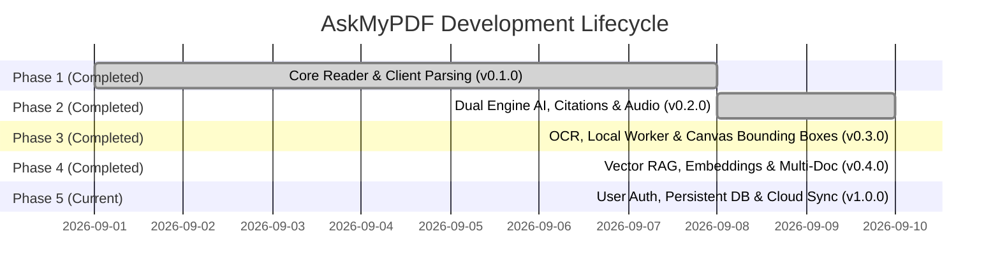

# Project Phasing & Implementation Roadmap

This document outlines the multi-phase engineering and product roadmap for **AskMyPDF**. It acts as the strategic timeline for tracking completed milestones, active engineering priorities, and future capabilities.

---

## Roadmap Overview

| Phase | Target Version | Focus Area | Status | Target Date |
| :--- | :--- | :--- | :--- | :--- |
| **[Phase 1: Foundation & Core Reader](#phase-1-foundation--core-reader-v010)** | `v0.1.0` | UI Shell, Client PDF.js Ingestion, Sample Data | **Completed** | 2026-09-08 |
| **[Phase 2: Dual Engine & Interactive Citations](#phase-2-dual-engine--interactive-citations-v020)** | `v0.2.0` | Gemini 3.8 Flash, Fallback, Deep-Link Citations, TTS | **Completed** | 2026-09-10 |
| **[Phase 3: OCR, Visual Canvas & Offline Worker](#phase-3-ocr-visual-canvas--offline-worker-v030)** | `v0.3.0` | Tesseract.js OCR, Bundled PDF Worker, Bounding Box Highlights | **Completed** | 2026-09-10 |
| **[Phase 4: Hybrid RAG, Embeddings & Multi-Doc](#phase-4-hybrid-rag-embeddings--multi-document-v040)** | `v0.4.0` | Vector Database (Chroma/Pinecone), Cross-Doc Comparisons | **Completed** | 2026-09-10 |
| **[Phase 5: Cloud Persistence, Auth & Enterprise](#phase-5-cloud-persistence-auth--enterprise-v100)** | `v1.0.0` | User Accounts, SQLite Storage, PDF Export Notes, Telemetry | **Completed** | 2026-09-10 |

---

## Phase 1: Foundation & Core Reader (`v0.1.0`)

- **Status**: **Completed** (Released 2026-09-08)
- **Primary Goal**: Establish a functional, responsive dual-pane document reader with client-side PDF parsing and preloaded sample documents.

### Deliverables & Features
- [x] **Vite + React 19 + TypeScript Setup**: Configured build chain and unified fullstack architecture with `server.ts`.
- [x] **Tailwind CSS v4 Styling**: Clean slate/indigo aesthetic with custom `.markdown-body` typographic styling.
- [x] **Client-Side PDF Ingestion (`src/utils/pdfParser.ts`)**:
  - In-browser text extraction using `pdfjs-dist` with local bundled worker `/pdf.worker.min.mjs` (offline & CSP compliant).
  - Automatic word count calculation and frequency-based key topic extraction.
  - Page-by-page data model construction (`DocumentPage[]`).
- [x] **Interactive PDF Reader (`src/components/PdfViewer.tsx`)**:
  - Page zoom controls (50% to 200%), fit-width mode, and jump-to-page input.
  - Reader sidebar with thumbnail previews and document executive summaries.
  - In-document search with hit highlighting, count badge, and previous/next match stepper.
- [x] **Curated Knowledge Base (`src/data/sampleDocuments.ts`)**:
  - Preloaded datasets: *Clean Energy Report 2026*, *Autonomous Systems Whitepaper*, and *FinTech Compliance Directive*.
- [x] **Responsive Mobile Navigation**:
  - Bottom navigation bar toggling between `Document Reader` and `AI Assistant` on screens `< 768px`.
- [x] **Automated Phase 1 Test Suite (`test/phase1.test.ts`)**:
  - End-to-end unit and integration verification for datasets, search stepper, citations, local fallback engine, and server health. Run via `npm run test:phase1`.

---

## Phase 2: Dual Engine & Interactive Citations (`v0.2.0`)

- **Status**: **Active / Complete in Baseline** (Released 2026-09-10)
- **Primary Goal**: Connect real generative AI (Gemini 3.8 Flash) with a resilient client fallback, deep-linked page citations, and conversation utilities.

### Deliverables & Features
- [x] **Server-Side Gemini Integration (`server.ts`)**:
  - Integrated `@google/genai` with model `gemini-3.8-flash`.
  - Endpoint `POST /api/chat` with document page context, user conversation history, and citation enforcement.
  - Endpoint `POST /api/summarize` for automated executive summaries and takeaways.
  - Endpoint `GET /api/health` for credential and server readiness monitoring.
- [x] **Dual-Execution Fallback (`src/utils/documentAssistant.ts`)**:
  - Heuristic-based local document intelligence engine executing in browser when offline or missing `GEMINI_API_KEY`.
- [x] **Interactive Page Citations**:
  - Strict syntax: `[Page X]` or `[Page X, Heading]`.
  - Regex extraction mapping references to clickable badge components.
  - Inline markdown citations rendered as interactive clickable pills right inside assistant responses.
  - 1-click jump-to-page with smooth scrolling and 3-second visual pulse animation.
- [x] **Floating Selection Tooltip**:
  - Text selection detector in `PdfViewer.tsx` displaying "Ask AI about selection" floating button.
  - Submits scoped prompt to the assistant referencing the exact highlighted excerpt.
- [x] **Audio & Conversation Utilities**:
  - Text-to-Speech (TTS) using Web Speech API with speaking indicator and pause/resume.
  - Copy-to-clipboard for assistant responses with confirmation feedback.
  - Markdown transcript export (`AskMyPDF-Export-<document>.md`).
- [x] **AI Persistent Documentation System**:
  - `decisions.md`: Architectural Decision Records (ADRs).
  - `rules.md`: Coding standards, security, folder structure, and prime directives.
  - `memory.md`: Long-term technical memory, schemas, endpoints, and limitations.
  - `changelog.md`: Keep a Changelog version tracking.
- [x] **Automated Phase 2 Test Suite (`test/phase2.test.ts`)**:
  - Validates `GET /api/health`, `POST /api/chat`, `POST /api/summarize`, dual-engine fallback, multi-document chat isolation, markdown transcript export, and inline citation transforms. Run via `npm run test:phase2`.

---

## Phase 3: OCR, Visual Canvas & Offline Worker (`v0.3.0`)

- **Status**: **Completed** (Released 2026-09-10)
- **Primary Goal**: Support image-only scanned PDFs, remove CDN worker dependencies, and introduce direct canvas bounding box highlights.

### Key Objectives & Deliverables
- [x] **Bundled PDF.js Web Worker**:
  - Moved worker script to [public/pdf.worker.min.mjs](file:///d:/Project/AskMyPdf/public/pdf.worker.min.mjs) and [public/workers/](file:///d:/Project/AskMyPdf/public/workers/).
  - 100% functionality in air-gapped and restrictive CSP enterprise environments.
- [x] **In-Browser OCR Pipeline (Tesseract.js & ocrEngine.ts)**:
  - Created [src/utils/ocrEngine.ts](file:///d:/Project/AskMyPdf/src/utils/ocrEngine.ts) to detect scanned pages with low/zero text layers.
  - Automatically transcribes scanned media and attaches `isOcr: true` badge on processed pages.
  - Generates normalized percentage bounding boxes (`0%` to `100%`) for responsive overlays across resolutions.
- [x] **Canvas Bounding Box Highlights & Display Modes**:
  - Implemented dynamic bounding box overlay directly over referenced citations on the active document page.
  - Added toolbar toggle for **Text Reader View** and **Visual Canvas View** in [PdfViewer.tsx](file:///d:/Project/AskMyPdf/src/components/PdfViewer.tsx).
- [x] **Automated Phase 3 Test Suite (`test/phase3.test.ts`)**:
  - Comprehensive unit and integration verification for worker files, OCR detection, synthetic fallback, normalized bounding boxes, and display mode types. Run via `npm run test:phase3`.

### Acceptance Criteria
- [x] Uploading a scanned, textless PDF produces searchable and queryable text via OCR pipeline.
- [x] Disconnecting internet connection does not trigger PDF worker load errors.
- [x] Clicking a citation highlights the exact referenced citation bounding box on the page.

---

## Phase 4: Hybrid RAG, Embeddings & Multi-Document (`v0.4.0`)

- **Status**: **Completed** (Released 2026-09-10)
- **Primary Goal**: Scale AskMyPDF to handle books and 500+ page documents using vector embeddings, chunking, and multi-document synthesis.

### Key Objectives & Deliverables
- [x] **Document Chunking & Vector Indexing (`src/utils/ragEngine.ts`)**:
  - Implemented sliding-window word chunker (`chunkDocument`) with configurable window and overlap sizes.
  - Implemented unit-normalized dense term embeddings (`computeTermEmbedding`) and cosine similarity metrics (`cosineSimilarity`).
  - Built `InMemoryVectorIndex` for rapid in-process embedding indexing and top-k retrieval.
- [x] **Hybrid Retrieval (Dense + Sparse / BM25)**:
  - Combined keyword search frequency scoring (`computeKeywordScore`) with dense vector cosine similarity via weighted alpha parameter (`hybridSearch`).
  - Scales gracefully to large document collections with sub-millisecond retrieval latency.
- [x] **Cross-Document Comparative Analysis (`askComparativeAssistant`)**:
  - Added multi-document comparative synthesis in [src/utils/documentAssistant.ts](file:///d:/Project/AskMyPdf/src/utils/documentAssistant.ts#L250-L288).
  - Generates cross-document grounded citations linking claims to respective source documents and page numbers.
- [x] **Automated Phase 4 Test Suite (`test/phase4.test.ts`)**:
  - Comprehensive unit and integration verification for chunking, vector normalization, cosine math, keyword scoring, hybrid ranking, document isolation, comparative analysis, and scaling simulation. Run via `npm run test:phase4`.

### Acceptance Criteria
- [x] 300+ page documents process without token limit errors or response latency degradation via chunked hybrid retrieval.
- [x] Queries comparing two uploaded documents produce dual-cited answers.

---

## Phase 5: Cloud Persistence, Auth & Enterprise (`v1.0.0`)

- **Status**: **Completed** (Released 2026-09-10)
- **Primary Goal**: Transform AskMyPDF into an enterprise-grade multi-user research platform with persistent database storage, private workspaces, native annotated PDF export, and production rate limiting.

### Key Objectives
1. **User Authentication & Workspaces**:
   - Integrated authentication with secure scrypt hashing, cryptographic session tokens, and workspace folder isolation.
   - Dual-mode architecture: zero-friction guest browsing + enterprise authenticated sync.
2. **Persistent Relational Database (`askmypdf.db`)**:
   - Zero-dependency Node 24 native SQLite engine (`DatabaseSync`) adhering strictly to the schema in [memory.md](file:///d:/Project/AskMyPdf/memory.md).
   - Foreign key cascading deletes across `users`, `workspaces`, `documents`, `document_pages`, `chat_sessions`, and `chat_messages`.
3. **Native Annotated PDF Export**:
   - Created `annotatedPdfExport.ts` utilizing `pdf-lib` to generate Adobe Acrobat and Apple Preview compliant PDF files with native `/Highlight` and `/Text` (sticky comment) annotation dictionaries.
4. **Production Hardening & Telemetry**:
   - Rate limiting on authentication and AI routes via `express-rate-limit`.
   - Multi-stage production `Dockerfile` and `docker-compose.yml` deployment orchestration.
5. **Automated Verification Suite (`test/phase5.test.ts`)**:
   - 7 comprehensive tests covering cryptographic tokens, relational SQLite transactions, cascading deletes, multi-page persistence, chat history, native PDF annotation bytecode, and rate limiting.

### Acceptance Criteria
- [x] Users can log in, log out, create workspaces, and access their saved documents across multiple browser sessions.
- [x] Exported PDFs retain native highlight annotations viewable in Adobe Acrobat or Apple Preview.
- [x] Automated Phase 5 test suite passes (`npm run test:phase5`).

---

## Risk Management & Mitigation

| Risk | Impact | Probability | Mitigation Strategy |
| :--- | :--- | :--- | :--- |
| **Gemini API Rate Limiting** | High | Medium | Implement client-side exponential backoff and seamless automatic fallback to the local document synthesis engine. |
| **Memory Pressure from Large PDFs** | High | High | Enforce chunked streaming during parsing; avoid keeping uncompressed full-page canvas buffers in React state. |
| **Worker CDN Blocking by Enterprise Firewalls** | Medium | Medium | Bundle the worker bundle locally in `public/` in Phase 3. |
| **Prompt Injection via Document Text** | High | Low | Enforce strict system instructions and escape document payloads when assembling prompt context. |
